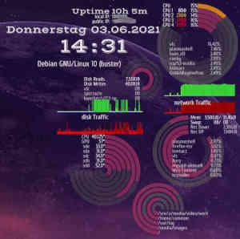
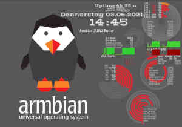

# conky.arcs

## History
I discovered conky when I installed TwisterOS on my rockpi4. It has
[conky-grapes theme](https://gitlab.nomagic.uk/popi/conky-grapes) enabled by default.
Nice looking, but completely illegible. Especially in the home theater, where the
image is projected onto screen via beamer.
I thought I had only minor change requests, however, conky's formatting skills turned
out to need a lot of improvement. conkys text formatting looked to complicated to me,
so I decided to draw all texts by myself.
That leaded to a complete rewrite of the theme.
First I had to create reliable text formatting functionality. Then I split the work,
so that conky does not display any text any more. Only the history graphs are
painted by conky.
The rest is created by lua script.

## Screenshots

## Why use it
**conky.arcs** has been developed for small media players like pi4 that drive your
home cinema. Therefore I selected fonts and fontsize for readability at long distance. It is published according [GPLv3](LICENSE), so feel free to use, study, improve and share as you please.

## Quickstart
If you already know conky:
  - install conky-full
  - clone this repo
  - execute `install` as user, which then generates your configuration and
    installs fonts and helper scripts

## Dependencies
it turned out, that hddtemp does not provide temperature values for some harddisks.
I have several of such drives. Therefore I used **smartctl** from
package *"smartmontools"* to retrieve temperature of harddisks. But as smartctl is
available to superuser only and conky is a user process - there's need for a
system service (a little helper script)

## Customize it
* the config file for all graphics is linked to your home directory
  - each set of rings has its own config-section
  - script that creates graphics based on configuration is separated,
    so you don't need to change it
  - please read [Documentation] (Documentation.md) for further details

